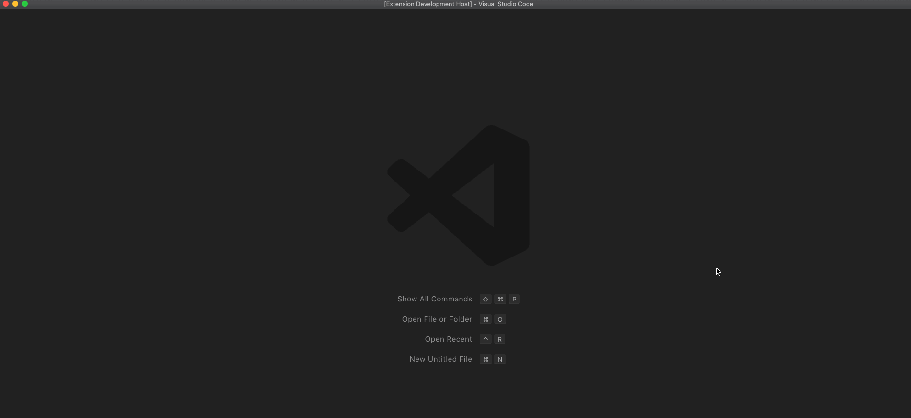

# VSCode Livewire Docs

Easily access Livewire framework documentation pages from within VSCode

## Features

To use this extension, simply use `⌘ + Shift + P` to open the command palette (`Ctrl` on windows / linux) and search for "Livewire Docs". You can also search for just "Docs" or the specific topic you're after, like "Data Binding"

Here's an example:  


## Development

The files for this extension are generated from the python script `build/build.py`. Run this command to rebuild all extension files:

```
    python3 build.py
```
